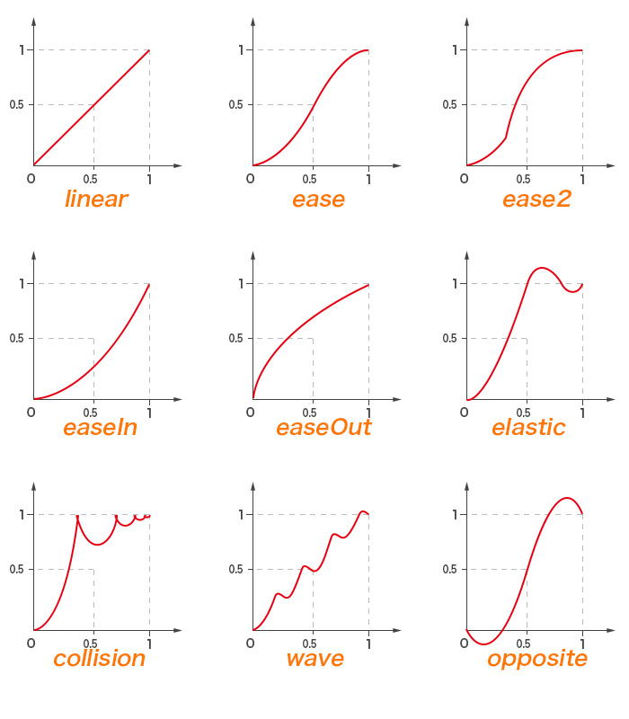

# move.js

move.js 是一个超轻量的js动画库, 它会返回一个move对象并被 ```window.move``` 变量引用. move对象优先使用 ```requestAnimationFrame```, 对于非现代浏览器降级为```setInterval```

=====
#### move下的API
	linear		--- 匀速运动
	ease 		--- 先加速后减速
	ease2 		--- 先加速一小段距离, 然后突然大提速, 最后减速
	easeIn 		--- 初速度为0, 一直加速
	easeOut 	--- 初速度较大, 一直减速
	elastic 	--- 弹性动画(终点附近来回摆动)
	collision 	--- 碰撞动画
	wave 		--- 断断续续加速减速
	opposite 	--- 先向反方向移动一小段距离, 然后正方向移动, 并超过终点一小段, 然后回到终点



=====
####用法和说明:
```<script src="move.min.js"></script>``` 引入即可

 move.js其实是一个数字的过渡函数库, 必须传入 一个包含两个数字的数组(如```[0, 2000]```), 一个回调函数```fn```, 时间不传则默认为500毫秒, 它会使用对应的动画曲线从0过渡到2000, 定时器每次会传入当前的过渡数字到```fn```中.  还可以选择性传入一个```fnEnd```, 作为动画完成之后的执行函数.

#####注意: 上面的过渡数组```[0, 2000]```, 和```fn``` 必须传入, 时间和```fnEnd```可不传, 四个参数无顺序之分.

从上可知, move.js 适用于任何包含数字的css属性的过渡, 比如box-shadow, border, transform, stroke等, 也就是字符串拼接这么简单.

move.js经过几次重构, 之前是类似于jquery那样传入包含属性的对象, 如{left: 500, top: 30}, 因为这样虽然方便, 但不够强大. 
#####很多前面提到的数字和字母混合的CSS属性难以提取数字进行过渡, 索性直接实现一个数值过渡的库. 在老浏览器中默认setInterval, 可以将时间相同的过度动画放一起(下面例2中), 以便进一步提升性能.

=====
#### 例子1:
```javascript
var box = document.getElementById("box");

var stop = move.ease([0, 500], function(v){
	box.style.left = v + 'px';
}, function(){
	alert('动画完成');
});
```
上面例子中调用的 ease动画(其他动画同理), ```box```是要操作的dom元素, ```[0, 500]```代表从0过渡到500, 使用ease曲线过渡, 每次定时器执行会传入一个当前过渡值到第三个参数回调函数中, 执行```move.ease```的时候会返回一个函数放在```stop```变量, 执行```stop```函数会停止正在执行的动画, ```stop``` h会返回当前过渡值, 以便下次继续.

=====
####例子2:
```javascript
var a = document.getElementById('a');
var b = document.getElementById('b');

//	设置时间为 2s 的过渡, 从 0 到 1, callback中可做为比例
var stop = move.collision([0, 1], 2000, function(v){
	a.style.left = v*1000 + 'px';	//设置 a 元素从 0px 向右移动 1000px
	b.style.left = v*200  + 'px';	//设置 b 元素从 0px 向右移动 200px
})
```
如果是老浏览器(不支持requestAnimationFrame的), 时间相同的过度动画放在一起, 可以提升性能, 因为无需多开一个定时器.


#### 为什么不使用链式操作?
从上面例子可知, 要想使用多种动画依次执行, 必须放入```fnEnd```函数中而不像jQuery那样使用链式操作将动画放入队列中, 原因如下:

* 若要使用链式操作, 必须使用动画队列. 每次执行完动画方法后需要返回 move 对象, 但 move 对象内部不包含 DOM 节点, 不易于将事件队列和 DOM 节点进行绑定, 所以同时执行多个 move 的方法, 动画队列不易区分. 
* jquery是直接对DOM节点操作(它可以把对应的动画队列绑定到节点上)且每次执行完会返回一个新对象. 但 move 不返回新对象.
* move 只是一个包含多种过渡动画的函数库(对象), 只负责数值之间各种过渡, 剩下的交给我们在```fn```中自由发挥

#### 添加新动画?
move.js 可以很方便地添加新动画, 操作如下:
```javascript
move.extend({
	fast: function(x){
		return x*x*x;
	}
})
```
上面传入的```fast```函数是一个动画曲线函数, 调用时会自动传入一个自变量```x```, 范围在```0```到```1```, 返回的值y的值域也最好在```0```到```1```, 如果动画结束, 会强行设置```y```为```1```.

然后就可以欢快地使用 ```move.fast([from, to], function(){ ... })``` 开始啪啪啪了......

=====
####许可协议
MIT


